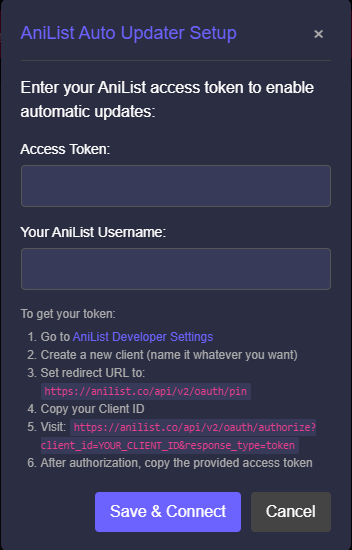

# Anime Sync

A powerful userscript that automatically tracks and syncs your anime watching progress across various streaming platforms to AniList. Features direct episode detection, smart season handling, and a clean UI for seamless progress updates.

> **Note**: This userscript is designed for desktop browsers only. Mobile browsers are not supported.

## Features

- 🔄 Automatic progress tracking and syncing
- 🎯 Direct episode detection
- 📺 Multi-platform support
- 🔍 Smart season handling
- 🎨 Clean and modern UI
- ⚡ Real-time updates
- 🔐 Secure authentication

## Supported Sites

Currently supported streaming platforms (Desktop version only):

- ✅ AnimePahe
- ✅ AniWatchTV

More platforms coming soon!

## Installation

> ⚠️ Desktop browsers only! This script does not work on mobile browsers.

1. Install a userscript manager:
   - [Tampermonkey](https://www.tampermonkey.net/) (Recommended)
   - [Greasemonkey](https://www.greasespot.net/)
   - [Violentmonkey](https://violentmonkey.github.io/)

2. [Click here](https://raw.githubusercontent.com/zenjahid/anime-sync/main/anime-sync-userscript.js) to install the script

3. Visit any supported streaming site and the setup dialog will automatically appear, or click the AniList Setup button in the bottom-left corner

4. Follow the instructions to connect your AniList account

## System Requirements

- Desktop browser (Chrome, Firefox, Edge, etc.)
- Userscript manager extension installed
- JavaScript enabled
- Supported streaming site accessed via desktop browser

## Connecting to AniList

To connect your AniList account, follow these steps:

1. Go to [AniList Developer Settings](https://anilist.co/settings/developer)
2. Click "Create New Client"
3. Fill in the client details:
   - Name: `Anime Sync` (or any name you prefer)
   - Redirect URL: `https://anilist.co/api/v2/oauth/pin`

4. After creating the client, you'll get a Client ID
5. Visit this URL (replace YOUR_CLIENT_ID with your actual Client ID):
   ```
   https://anilist.co/api/v2/oauth/authorize?client_id=YOUR_CLIENT_ID&response_type=token
   ```
6. Authorize the application
7. Copy the provided access token
8. The AniList Setup dialog will automatically appear when you visit a supported streaming site. Alternatively, you can click the "AniList Setup" button in the bottom-left corner if needed.

   

9. Paste your access token and enter your AniList username in the setup dialog
10. Click "Save & Connect"

Your account is now connected! The script will automatically update your progress as you watch anime.

Note: Your access token is stored locally and is never sent to any server other than AniList's API.

## Usage

1. Visit any supported streaming site
2. Play an anime episode
3. The script will automatically detect and update your progress
4. A notification will appear confirming the update
5. Manual update button available if needed

## Todo List

- [ ] Add MyAnimeList (MAL) support
- [ ] Add more Website support
- [ ] Create browser extension version

## Request Site Support

Need support for a specific streaming site? Here's how to request it:

1. Go to the [Issues](https://github.com/zenjahid/anime-sync/issues) page
2. Click "New Issue"
3. Use the title format: `[Site Request] SiteName`
4. Include in your request:
   - Site URL
   - Example episode page URL
   - Any specific features of the site
   - Why you think this site should be supported

## Contributing

Contributions are welcome! Feel free to:

1. Fork the repository
2. Create your feature branch (`git checkout -b feature/AmazingFeature`)
3. Commit your changes (`git commit -m 'Add some AmazingFeature'`)
4. Push to the branch (`git push origin feature/AmazingFeature`)
5. Open a Pull Request

## Author


- GitHub: [@zenjahid](https://github.com/zenjahid)

## License

This project is licensed under the MIT License - see the [LICENSE](LICENSE) file for details.

## Acknowledgments

- Thanks to AniList for providing the API
- All the amazing anime streaming sites
- The open-source community

---

If you find this project helpful, please consider giving it a ⭐! 